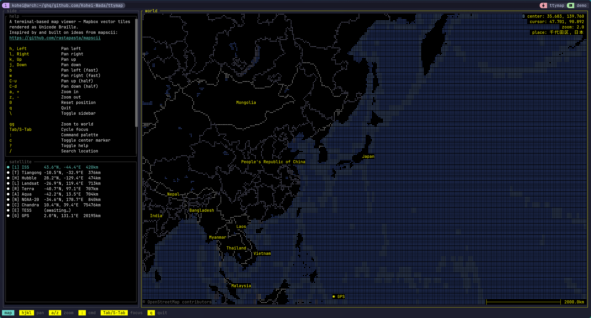
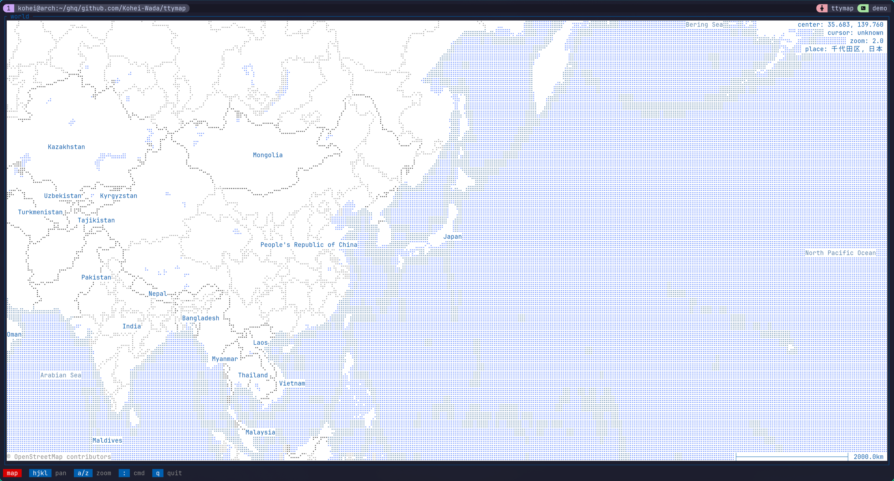
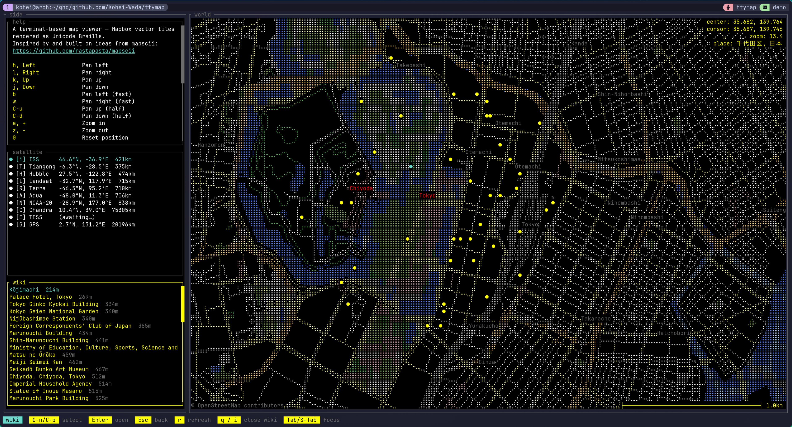

# ttymap

Terminal-based map viewer. Renders [Mapbox Vector Tiles](https://github.com/mapbox/vector-tile-spec) as Unicode Braille characters with ANSI 256-color in your terminal.

Inspired by [mapscii](https://github.com/rastapasta/mapscii).



<details>
<summary>More screenshots</summary>

Bright theme:



Tokyo zoomed in with the wiki panel open and live aircraft markers:



</details>

## Features

- **Braille rendering** — 2×4 sub-pixels per cell, ANSI 256-color
- **Vim-style navigation** — `hjkl` pan (with count prefixes like `5j`), `a`/`z` zoom, `gg` world view, mouse drag + scroll
- **Command palette** — `:` for actions, `/` for Nominatim location search
- **Live overlays** — aircraft (OpenSky), satellites (TLE + SGP4), earthquakes (USGS), Wikipedia geosearch
- **Headless snapshot** — `ttymap snap …` writes the current view as ANSI text for dashboards / cron / pipes
- **Lua plugin runtime** — every in-tree feature is a Lua script under `runtime/plugin/`; user plugins go in `~/.config/ttymap/plugin/` (Neovim-style stem-dedup)
- **Lua-based config** — `~/.config/ttymap/init.lua`, with conditional / computed values (the killer feature over TOML)

## Install

```bash
git clone https://github.com/Kohei-Wada/ttymap
cd ttymap
make install
```

Installs `~/.cargo/bin/ttymap` + `~/.local/share/ttymap/` (bundled
runtime). Single-user, no root. `cargo install` alone fails fast
with a "did you `make install`?" message because the runtime needs
to be placed.

## Usage

**Interactive:**

```bash
ttymap                                       # default position
ttymap --lat 35.68 --lon 139.76 --zoom 10    # Tokyo
ttymap --here                                # IP-based current location
ttymap --style bright                        # bright theme
```

**Headless snapshot:**

```bash
ttymap snap --lat 35.68 --lon 139.76 --zoom 12               # → stdout
ttymap snap --lat 35.68 --lon 139.76 --zoom 12 -o tokyo.ans  # → file
ttymap snap --here --cols 120 --rows 40                      # IP-located, sized
```

`snap` emits raw xterm-256 ANSI; `cat` the file in any compatible
terminal or pipe to `less -R`.

Press `?` in interactive mode for the live keymap cheatsheet.

## Build

```bash
cargo build       # build.rs compiles proto/vector_tile.proto via protox
cargo test
cargo clippy
```

Rust 2024 edition. The build uses `protox` so no system `protoc` is
needed.

## Documentation

- **[docs/architecture.md](docs/architecture.md)** — system layout, threads, message + render flow, focus model, concurrency
- **[docs/configuration.md](docs/configuration.md)** — `init.lua` reference, runtime path resolution, file locations
- **[docs/lua-architecture.md](docs/lua-architecture.md)** — plugin authoring guide: `ttymap.api.*` surface, plugin shapes, dispatcher semantics
- **[docs/lua-plugin-migration.md](docs/lua-plugin-migration.md)** — end-to-end before/after examples for each plugin shape
- **[docs/design.md](docs/design.md)** — load-bearing design decisions (UserIntent vs direct call, controller split, Drop-based cleanup)

## Roadmap

ttymap aims to be a **modern Rust replacement for mapscii** — a
terminal map viewer at heart, but with a first-class plugin story so
domain-specific overlays (planes, ships, weather, …) live outside
the core.

Principles:

- **Core stays lean.** A map viewer, not a GIS platform. Tiles, projection, rendering, navigation. Anything domain-specific is a Lua plugin.
- **Plugin-first.** Every built-in is a Lua script — the bridge dogfoods itself.
- **Boring where it matters.** Stable protocols (MVT, OSM), predictable resource use, `cargo install` ships a single binary.

Short-term work + plugin candidates are tracked in [GitHub
issues](https://github.com/Kohei-Wada/ttymap/issues). Notable
in-flight: alternate tile backends ([#30](https://github.com/Kohei-Wada/ttymap/issues/30)
MBTiles, [#31](https://github.com/Kohei-Wada/ttymap/issues/31)
PMTiles), error handling policy
([#17](https://github.com/Kohei-Wada/ttymap/issues/17)).

## Contributing

- **Add a feature to core** — open an issue first to sanity-check it isn't plugin material.
- **Write a plugin** — see [docs/lua-plugin-migration.md](docs/lua-plugin-migration.md). Drop a `*.lua` into `~/.config/ttymap/plugin/` to test without rebuilding. Simplest fetch+render: `runtime/plugin/quake.lua`. Full panel + selection + modal: `runtime/plugin/wiki/`. Debounced palette picker: `runtime/plugin/search/`.
- **Fix a bug** — PRs welcome. The pre-commit hook runs tests, clippy, and rustfmt.

## License

Dual-licensed under either of

- Apache License, Version 2.0 ([LICENSE-APACHE](LICENSE-APACHE) or <http://www.apache.org/licenses/LICENSE-2.0>)
- MIT license ([LICENSE-MIT](LICENSE-MIT) or <https://opensource.org/licenses/MIT>)

at your option.

Unless you explicitly state otherwise, any contribution intentionally
submitted for inclusion in the work by you, as defined in the
Apache-2.0 license, shall be dual-licensed as above, without any
additional terms or conditions.
